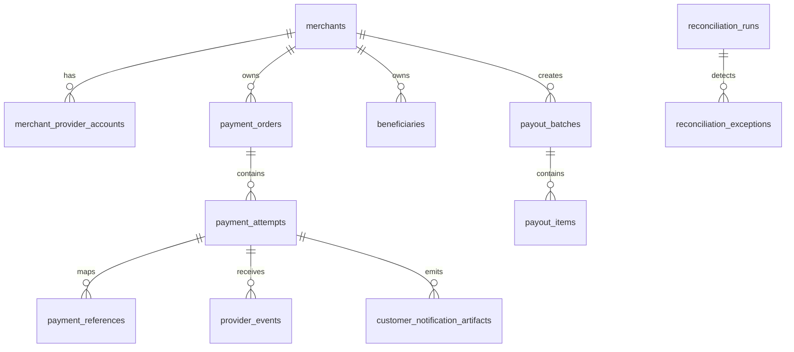

# Modelo de Dominio Canonico v1

Fecha de actualizacion: 2026-04-29

## 1. Proposito

Definir el modelo conceptual minimo del producto para desacoplar el dominio de los payloads crudos de los proveedores.

## 2. Bounded contexts

## 2.1 Merchant Management

Responsable de:

- comercios
- usuarios y roles
- credenciales por proveedor
- activaciones y capacidades por comercio

## 2.2 Pay-in Orchestration

Responsable de:

- ordenes de pago
- intentos
- checkout sessions
- routing
- fallback y retry
- estados canonicos

## 2.3 Provider Integration

Responsable de:

- adapters por proveedor
- mapping de requests/responses
- webhooks
- consultas de estado
- clasificacion de errores

## 2.4 Payout Orchestration

Responsable de:

- beneficiarios
- lotes
- items
- aprobaciones
- estados de dispersion

## 2.5 Operations and Reconciliation

Responsable de:

- timeline operativa
- artefactos visibles al cliente
- conciliacion
- excepciones
- soporte

## 3. Entidades canonicas

## 3.1 merchants

Representa una organizacion usuaria de la plataforma.

Campos clave sugeridos:

- `id`
- `legal_name`
- `merchant_type`
- `country_code`
- `status`
- `risk_level`
- `created_at`

## 3.2 merchant_provider_accounts

Representa la habilitacion de un comercio con un proveedor.

Campos clave sugeridos:

- `id`
- `merchant_id`
- `provider_code`
- `environment`
- `account_mode`
- `activation_status`
- `capabilities_snapshot`

## 3.3 payment_orders

Representa la intencion de cobro del negocio.

Campos clave sugeridos:

- `id`
- `merchant_id`
- `external_reference`
- `amount_in_cents`
- `currency`
- `order_status`
- `customer_id`
- `expires_at`
- `created_at`

Regla:

- una `payment_order` puede tener multiples `payment_attempts`

## 3.4 payment_attempts

Representa un intento real de cobro en un proveedor.

Campos clave sugeridos:

- `id`
- `payment_order_id`
- `attempt_number`
- `provider_code`
- `method_family`
- `routing_reason`
- `canonical_status`
- `raw_provider_status`
- `failure_classification`
- `redirect_url`
- `provider_transaction_id`
- `started_at`
- `finished_at`

Reglas:

- cada reintento crea un nuevo registro
- el intento no sobreescribe el historico de intentos anteriores

## 3.5 payment_references

Mapa de referencias internas y externas.

Campos clave sugeridos:

- `id`
- `payment_attempt_id`
- `reference_type`
- `reference_value`
- `issuer`
- `visibility_scope`

Ejemplos de `reference_type`:

- `merchant_reference`
- `provider_transaction_id`
- `cus`
- `authorization`
- `receipt`
- `ref_payco`
- `ticket_id`

## 3.6 checkout_sessions

Representa la sesion visible al pagador.

Campos clave sugeridos:

- `id`
- `payment_order_id`
- `session_status`
- `customer_contact_captured`
- `financial_entity_code`
- `expires_at`
- `closed_at`

## 3.7 provider_events

Representa cada webhook o evento recibido.

Campos clave sugeridos:

- `id`
- `provider_code`
- `event_type`
- `source_environment`
- `signature_valid`
- `deduplication_key`
- `raw_headers`
- `raw_payload`
- `received_at`
- `processed_at`

## 3.8 customer_notification_artifacts

Representa correos, vouchers o artefactos visibles al usuario.

Campos clave sugeridos:

- `id`
- `payment_attempt_id`
- `emitter`
- `channel`
- `subject`
- `reported_status`
- `artifact_location`
- `sent_at`

## 3.9 beneficiaries

Representa un destinatario de payout.

Campos clave sugeridos:

- `id`
- `merchant_id`
- `beneficiary_type`
- `document_type`
- `document_number`
- `destination_type`
- `destination_reference`
- `validation_status`

## 3.10 payout_batches

Representa un lote de dispersiones.

Campos clave sugeridos:

- `id`
- `merchant_id`
- `provider_code`
- `source_account_id`
- `batch_status`
- `requested_at`
- `approved_at`
- `sent_at`

## 3.11 payout_items

Representa cada dispersion individual dentro de un lote.

Campos clave sugeridos:

- `id`
- `payout_batch_id`
- `beneficiary_id`
- `amount_in_cents`
- `canonical_status`
- `provider_reference`

## 3.12 reconciliation_runs

Representa una ejecucion de conciliacion.

Campos clave sugeridos:

- `id`
- `provider_code`
- `scope_type`
- `started_at`
- `finished_at`
- `result_status`

## 3.13 reconciliation_exceptions

Representa diferencias detectadas.

Campos clave sugeridos:

- `id`
- `reconciliation_run_id`
- `entity_type`
- `entity_id`
- `exception_type`
- `severity`
- `resolution_status`

## 4. Estados canonicos sugeridos

## 4.1 payment_order

- `DRAFT`
- `OPEN`
- `IN_PROGRESS`
- `APPROVED`
- `REJECTED`
- `FAILED`
- `EXPIRED`
- `CANCELLED`
- `REVERSED`

## 4.2 payment_attempt

- `ATTEMPT_CREATED`
- `CHECKOUT_SESSION_STARTED`
- `PROVIDER_REDIRECT_READY`
- `PAYER_REDIRECTED`
- `AWAITING_PAYER_ACTION`
- `AWAITING_PROVIDER_CONFIRMATION`
- `PENDING_MANUAL_REVIEW`
- `APPROVED`
- `REJECTED`
- `FAILED_TO_CREATE`
- `FAILED_PROCESSING`
- `ABANDONED_BY_PAYER`
- `EXPIRED`
- `CANCELLED`
- `REVERSED_OR_NULLIFIED`

## 4.3 payout_item

- `DRAFT`
- `PENDING_APPROVAL`
- `APPROVED_FOR_SEND`
- `SUBMITTED`
- `IN_PROGRESS`
- `PAID`
- `REJECTED`
- `FAILED`
- `REVERSED`

## 5. Relaciones principales

## 6. Invariantes del dominio

1. Una `payment_order` nunca pierde el historico de sus intentos.
2. Un `payment_attempt` nunca cambia de proveedor una vez creado.
3. El estado final de un intento no puede depender solo del frontend.
4. Un webhook procesado no puede generar efectos duplicados.
5. Un `retry` siempre crea un nuevo `payment_attempt`.
6. Un `payment_reference` no debe destruir referencias previas del mismo intento.
7. Un `payout_batch` y sus `payout_items` deben poder reconciliarse por separado.

## 7. Agregados recomendados

- agregado `Payment Order`
- agregado `Payment Attempt`
- agregado `Merchant Provider Account`
- agregado `Beneficiary`
- agregado `Payout Batch`

## 8. Eventos internos recomendados

- `payment_order.created`
- `payment_attempt.created`
- `payment_attempt.redirected`
- `payment_attempt.finalized`
- `provider_event.received`
- `provider_event.validated`
- `reconciliation.exception_detected`
- `payout_batch.submitted`
- `payout_item.finalized`

## 9. Conclusion

Este modelo canonico separa intencion de negocio, intento tecnico, evidencia operativa y verdad financiera. Esa separacion es la base para que el proyecto pueda soportar `PSE`, `Bre-B`, multiproveedor, conciliacion y payouts sin acoplarse a un solo proveedor.

