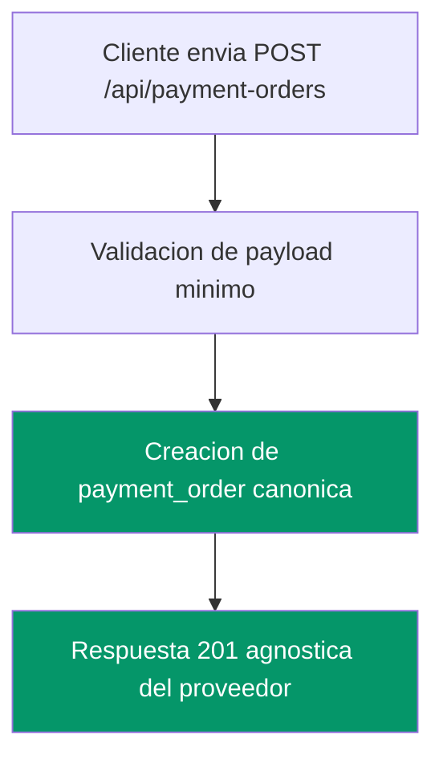
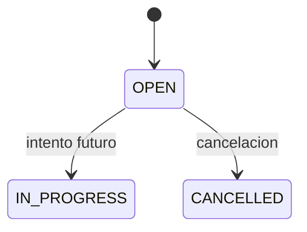

## Problem Statement

`Platform Owner` y futuros integradores necesitan la primera capacidad
implementable del dominio para crear una `payment_order` independiente del
proveedor. Sin esta base, el proyecto no puede pasar de definicion documental a
una primera vertical tecnica trazable.

## Stakeholders afectados

| Rol | Persona / cargo | Impacto | Valida |
|---|---|---|---|
| `Platform Owner` | Juan Castrejon | alto | si |
| `Developer Integrator` | integrador tecnico | medio | no |
| `QA / Code Reviewer` | revisor humano | medio | si |

## Objetivo del cambio

Definir el primer change OpenSpec de producto para crear una `payment_order`
canonica y exponer una ruta inicial `POST /api/payment-orders` sin introducir
proveedores reales, `payment_attempt`, persistencia ni multi-tenant completo.

## Fuentes revisadas

- `docs/backlog/slices/slice-payment-order-bootstrap.md`
- `docs/requisitos/requisitos-funcionales-consolidados.md`
- `docs/requisitos/catalogo-de-casos-de-uso-consolidado.md`
- `docs/dominio/modelo-de-dominio-canonico.md`
- `docs/adr/adr-0002-separacion-entre-payment-order-y-payment-attempt.md`
- `docs/adr/adr-0004-software-only-orchestration-como-punto-de-partida.md`
- `openspec/specs/payment-order-attempt-separation/spec.md`
- `openspec/specs/project-scope-vision/spec.md`

## Estado actual observado

- El repositorio ya define `payment_order` como entidad de negocio separada.
- Existe slice pack lista para ejecucion, pero no habia change OpenSpec abierto.
- El dominio canónico ya prohíbe mezclar `payment_order` y `payment_attempt`.
- La primera vertical todavia no define payload minimo ni contrato HTTP formal.

## Proceso AS-IS

N/A - capacidad nueva apoyada en investigacion ya consolidada.

## Proceso TO-BE (propuesto)

## Diagrama de estados (si aplica)

## Reglas de negocio detectadas

| ID | Regla | Módulo(s) | Tipo | Fuente | Estado |
|---|---|---|---|---|---|
| `RN-PAY-002` | `payment_order` y `payment_attempt` son entidades separadas. | pay-in orchestration | dominio | `docs/adr/adr-0002-separacion-entre-payment-order-y-payment-attempt.md` | vigente |
| `RN-PAY-006` | Crear una `payment_order` no crea automaticamente un `payment_attempt`. | payment order bootstrap | operativa | `docs/backlog/slices/slice-payment-order-bootstrap.md` | vigente |
| `RN-PAY-007` | La respuesta inicial de creacion de orden debe ser canonica y agnostica del proveedor. | payment core, web | general | `docs/backlog/slices/slice-payment-order-bootstrap.md` | vigente |

## Drift / restricciones

- El slice pack pide una respuesta canonica, pero no fija aun el payload minimo exacto.
- El change debe mantenerse estrictamente dentro de una vertical minima.
- Persistencia, `payment_attempt`, proveedores y multi-tenant quedan fuera.

## Alcance propuesto

- helper o caso de uso canonico para crear `payment_order`
- definicion del payload minimo de entrada
- contrato inicial de `POST /api/payment-orders`
- documentacion explicita de exclusiones de alcance

## Capacidades candidatas

- `payment-order-bootstrap` (nueva)

## Preguntas abiertas

- cual es el payload minimo exacto de entrada de la primera iteracion
- la capacidad debe devolver `id` temporal o contrato estable desde el inicio
