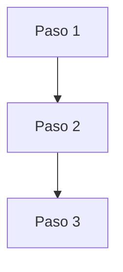
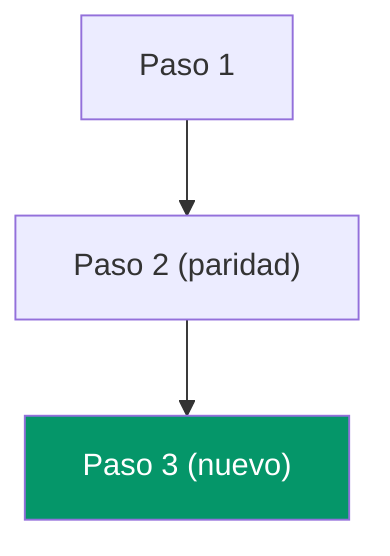
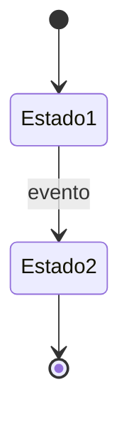

## Problem Statement

<!-- En 2-3 oraciones: que problema resuelve este cambio, para quien y por que ahora.
     Formato: "[Rol/stakeholder] necesita [capacidad] porque [problema/oportunidad].
     Sin esto, [consecuencia concreta]." -->

## Stakeholders afectados

<!-- Identificar quién se beneficia, quién valida y quién opera -->

| Rol | Persona / cargo | Impacto | Valida |
|---|---|---|---|
| <!-- rol del sistema --> | <!-- nombre o cargo --> | <!-- bajo/medio/alto --> | <!-- sí/no --> |

## Objetivo del cambio

<!-- Qué se quiere resolver o habilitar y por qué importa ahora -->

## Fuentes revisadas

<!-- Lista explícita de specs, docs, tablas, pantallas o runtime inspeccionado -->

## Estado actual observado

<!-- Hallazgos confirmados con evidencia -->

## Proceso AS-IS

<!-- Diagrama Mermaid del flujo actual (si aplica).
     Si el cambio no altera un flujo existente, marcar "N/A - capacidad nueva". -->

## Proceso TO-BE (propuesto)

<!-- Diagrama Mermaid del flujo esperado en el sistema nuevo post-cambio.
     Marcar en color los nodos nuevos vs los que mantienen paridad. -->

## Diagrama de estados (si aplica)

<!-- Para entidades con lifecycle (documentos, órdenes, permisos, etc.).
     Si no aplica, eliminar esta sección del research final. -->

## Reglas de negocio detectadas

<!-- Extraer y listar reglas identificadas durante la investigación.
     Estas reglas deben catalogarse tambien en docs/domain/reglas-negocio-catalogo.md -->

| ID | Regla | Módulo(s) | Tipo | Fuente | Estado |
|---|---|---|---|---|---|
| <!-- RN-XXX --> | <!-- descripción --> | <!-- módulo --> | <!-- general/cliente/DIAN/operativa --> | <!-- archivo:línea --> | <!-- vigente/pendiente-validación --> |

## Drift / restricciones

<!-- Diferencias entre fuentes, restricciones operativas, supuestos o huecos -->

## Alcance propuesto

<!-- Qué entra en este cambio y qué queda fuera -->

## Capacidades candidatas

<!-- Capacidades OpenSpec nuevas o existentes que este cambio tocará -->

## Preguntas abiertas

<!-- Decisiones o vacíos que deben resolverse antes o durante la implementación -->
